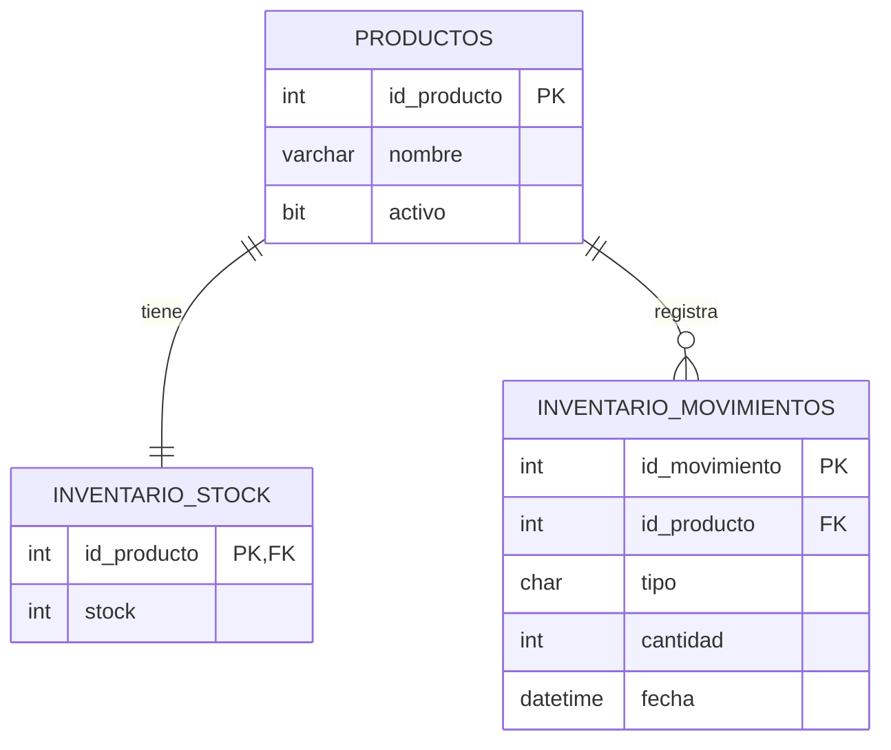

```mermaid
erDiagram
    PRODUCTOS {
        int id_producto PK
        varchar nombre
        bit activo
    }

    INVENTARIO_STOCK {
        int id_producto PK, FK
        int stock
    }

    INVENTARIO_MOVIMIENTOS {
        int id_movimiento PK
        int id_producto FK
        char tipo
        int cantidad
        datetime fecha
    }

    PRODUCTOS ||--|| INVENTARIO_STOCK : tiene
    PRODUCTOS ||--o{ INVENTARIO_MOVIMIENTOS : registra
```